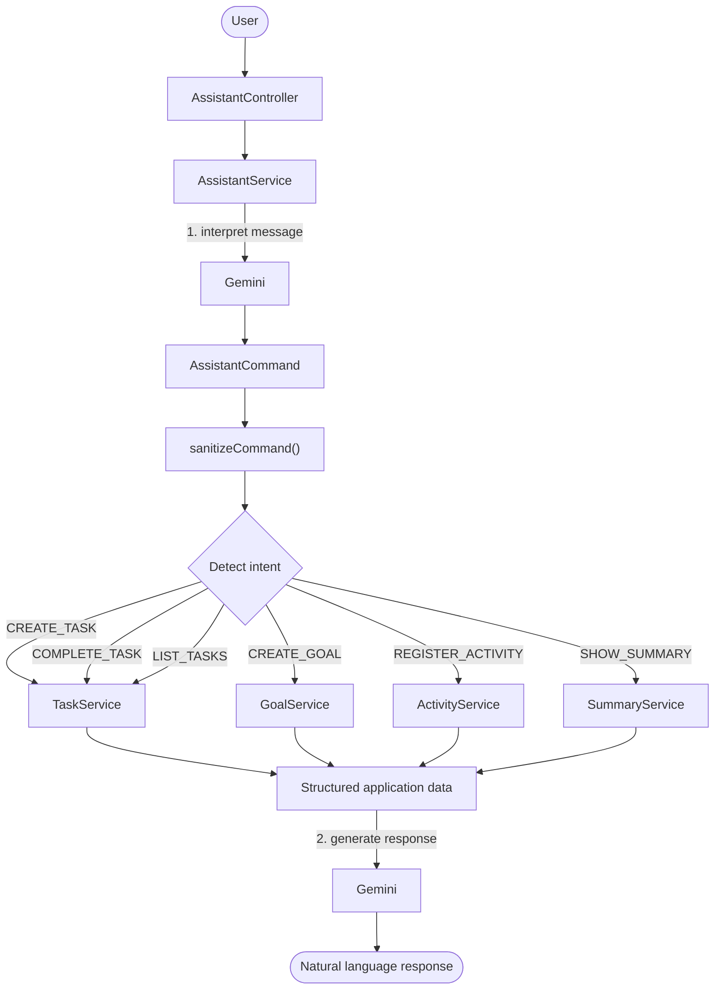

# README

# ✨ Lume

**An AI-powered personal productivity assistant built with Java and Spring Boot.**

Manage Tasks, Goals and Activities through a REST API — or just talk to it in natural language.

[Java 21](https://img.shields.io/badge/Java-21-ED8B00?style=for-the-badge&logo=openjdk&logoColor=white)

[Spring Boot](https://img.shields.io/badge/Spring%20Boot-4.1.1-6DB33F?style=for-the-badge&logo=springboot&logoColor=white)

[Spring AI](https://img.shields.io/badge/Spring%20AI-2.0.1-6DB33F?style=for-the-badge&logo=spring&logoColor=white)

[Google Gemini](https://img.shields.io/badge/Google%20Gemini-4285F4?style=for-the-badge&logo=googlegemini&logoColor=white)

[PostgreSQL](https://img.shields.io/badge/PostgreSQL-4169E1?style=for-the-badge&logo=postgresql&logoColor=white)

---

## 📌 About

Lume lets users register what they want to do, what they want to achieve and what they have already done, then understands messages like:

> *“Quero estudar Java por 10 horas essa semana.”“Estudei Java por 1 hora hoje.”“O que eu ainda tenho para fazer?”*

> *“I want to study Java for 10 hours this week.”“I studied Java for 1 hour today.”“What do i still have to do?”*

The core idea of the project is a **strict separation of responsibilities**:

> 🧠 **The AI interprets user intent.**
⚙️ **Java controls business rules and database operations.**
> 

The model never touches the database and never decides deterministic business rules. It only turns free text into a structured command, which is validated and executed by regular Spring services.

## 📑 Table of Contents

- [Technologies](about:blank#-technologies)
- [Features](about:blank#-features)
- [The process](about:blank#-the-process)
- [What I learned](about:blank#-what-i-learned)
- [How can it be improved](about:blank#-how-can-it-be-improved)
- [Running the project](about:blank#-running-the-project)

---

## 🛠 Technologies

| Area | Technology |
| --- | --- |
| Language | Java 21 |
| Framework | Spring Boot 4.1.1 |
| AI integration | Spring AI 2.0.1 + Google Gemini |
| Database | PostgreSQL |
| Persistence | Spring Data JPA + Hibernate |
| JSON | Jackson 3 |
| Build | Gradle |
| Tests | Spring Boot Test + MockMvc |
| Tools | IntelliJ IDEA, Postman |

Spring AI’s `ChatClient` connects the Java application to Gemini and is used to obtain **structured output** that is converted directly into Java objects.

---

## 🚀 Features

### ✅ Task Management

A Task represents something the user plans to do.

- Title and description
- Target duration (`durationMinutes`)
- Due date (`dueAt`)
- Status: `PENDING`, `RUNNING`, `COMPLETED`, `CANCELED`
- Completion date (`completedAt`)
- Progress calculated from related Activities

When the sum of the related Activities reaches the Task’s target duration, the Task is **automatically marked as completed**. A canceled Task **stays canceled**, even if Activities are added or changed later.

> Example: a Task with a target of 120 minutes and two Activities of 60 minutes each reaches 100% and becomes `COMPLETED`.
> 

### 🎯 Goal Management

A Goal is a measurable objective tracked over a period.

- Title and description
- Period (`goalPeriod`)
- Target value and unit: `MINUTES`, `HOURS`, `DAYS`, `TIMES`
- Calculated progress and percentage

Examples:

- Study Java for 10 hours this week
- Practice programming 5 times this month
- Study for 30 minutes every day

### 📝 Activity Management

An Activity is something the user **has already done**.

- Description, duration and date
- Optional Task and optional Goal

```
Independent  ──  Linked to a Task  ──  Linked to a Goal  ──  Linked to both
```

Creating, updating or deleting an Activity triggers the recalculation of the related Task and Goal progress.

### 📊 Progress Tracking

Progress is **derived from Activities**, never entered manually.

| Target unit | How progress is calculated |
| --- | --- |
| Task (minutes) | Sum of Activity durations |
| `MINUTES` | Sum of Activity durations |
| `HOURS` | Sum of durations ÷ 60 |
| `TIMES` | Number of Activities |
| `DAYS` | Number of distinct Activity dates |

The result is converted into a percentage of the target value.

### 🗓 Summaries

Structured summaries generated by Java and presented naturally by Lume.

- **Periods:** `DAILY`, `WEEKLY`, `MONTHLY`
- **Types:**
    - `ACTIVITY` — what the user has already done
    - `PENDING` — pending Tasks and Goals

Examples: *“What did I do this week?”* · *“What do I still have to do?”*

### 💬 Natural Language Assistant

Lume interprets messages such as:

```
Quero estudar Java hoje por 2 horas.
Quero estudar Java por 10 horas essa semana.
Estudei Java por 1 hora hoje.
Concluí a tarefa de estudar Java.
O que eu ainda tenho para fazer?

============================================

I want to study Java today for 2 hours.
I want to study Java for 10 hours this week.
I studied Java for an hour today.
I did the Java Study task.
What do I still have to do?
```

Supported intents:

| Intent | Purpose |
| --- | --- |
| `CREATE_TASK` | Create a Task |
| `CREATE_GOAL` | Create a Goal |
| `REGISTER_ACTIVITY` | Register something already done |
| `COMPLETE_TASK` | Mark a Task as completed |
| `LIST_TASKS` | List / filter Tasks |
| `SHOW_SUMMARY` | Show an activity or pending summary |
| `UNKNOWN` | Message not understood |

---

## 🔄 The process

The application keeps a clear boundary between **AI interpretation** and **business logic**.



### 1. AI interpretation

The first Gemini request only understands the user’s intention. For example:

```
"Quero estudar Java por 10 horas essa semana"
"I want to study Java for 10 hours this weeek."
```

becomes (simplified):

```json
{
  "intent": "CREATE_GOAL",
  "title": "Estudar Java", // Study Java
  "targetValue": 10,
  "targetUnit": "HOURS",
  "goalPeriod": "WEEKLY"
}
```

The model **does not modify the database**.

### 2. Command sanitization

`AssistantCommand` groups fields used by different operations, so the model can occasionally fill in fields that don’t belong to the detected intent. `sanitizeCommand()` uses the intent to remove them.

| Intent | Fields that must be removed |
| --- | --- |
| `CREATE_GOAL` | `taskId`, `dueAt`, `summaryType`, `summaryPeriod` |
| `CREATE_TASK` | `goalPeriod`, `targetValue`, `targetUnit`, `summaryType`, `summaryPeriod` |
| `LIST_TASKS` | everything except fields relevant to task listing/filtering |

The AI provides interpretation; Java guarantees consistency.

### 3. Business logic

The command is executed by the appropriate service. The services are responsible for:

- Validation
- Repository access
- Entity creation and updates
- Progress calculations
- Status changes
- Relationship management

### 4. Date handling

The current date is sent to the model dynamically, and the rules are explicit:

- Date without time → the date is returned and `dueAt` may be `null` (Java can interpret it as the end of that day).
- Explicit time → `dueAt` holds the real date and time.
- **The AI never invents a time the user did not provide.**

### 5. Final response

Java first builds a structured DTO, for example:

```
PendingSummary
 ├── pendingTasks
 └── pendingGoals
```

That data is sent to Gemini, which writes the final answer. This avoids hard-coded messages in Java **and** prevents the AI from inventing database information.

```
Database → Java Services → Structured DTO → Gemini → Natural language
```

---

## 📚 What I learned

### Spring Boot architecture

Organizing an application into **Controller, Service, Repository, Entity, DTO, Exception and Configuration** layers, and why business rules belong in the service layer instead of being spread across controllers or entities.

### JPA relationships

Implementing `Activity → Task` and `Activity → Goal` with nullable foreign keys, and understanding how updates differ from inserts when relationships can change. Moving an Activity from Goal A to Goal B, for instance, requires recalculating **both** Goals.

### Derived data

Calculating progress from Activities instead of storing duplicated values keeps the Activities as the single source of truth and reduces inconsistencies.

```
Activity 60 min + Activity 40 min + Activity 20 min
                    ↓
          Task progress = 120 min
                    ↓
              Task = COMPLETED
```

### DTOs

Separating the external API representation from internal entities. This became especially important with AI, since the model works through `AssistantCommand` while the rest of the application keeps its own request and response DTOs.

### Spring AI

Using `ChatClient` to send system instructions and user messages, inject dynamic data (such as the current date), request structured output, convert responses into Java objects and generate natural-language answers from structured data. It also showed me the importance of **validating imperfect model output before executing any business operation**.

It’s important to say that the AI uses tokens fast, so I cannot test the summary function correctly as it uses all the available tokens for the day, because i use a free plan, but of course this is fixable in the future.


### AI and deterministic business logic

The AI can understand *“Estudei Java por duas horas” “I have studied Java for 2 hours”*, but Java decides:

- Which Activity should be created?
- Which Goal should be updated?
- How is progress calculated?
- Should a Task become completed?

This separates probabilistic AI behavior from deterministic application behavior.

### Testing

Writing integration tests with Spring Boot and MockMvc to validate that Activities affect Task progress and that Tasks become completed when their target duration is reached.

---

## 🔮 How can it be improved

| Improvement | Description |
| --- | --- |
| **Multiple operations** | Handle messages such as *“Crie uma meta de estudar Java por 10 horas essa semana e uma meta de estudar segurança por 5 horas”*  “Create a goal of studying Java for 10 hours this week and a goal of studying cybersecurity for 5 hours” by returning a list of structured commands instead of a single `AssistantCommand`. |
| **Goal → Task decomposition** | Turn a Goal (e.g. 10 hours of Java this week) into smaller Tasks distributed across the week: the Goal is the objective, the Tasks are the concrete actions. |
| **Conversation memory** | Keep conversational context so users can say *“Divida ela em tarefas” “Divide it in tasks”* after creating a Goal. Tasks, Goals and Activities stay in PostgreSQL; memory stores only conversation context. |
| **Entity resolution** | Resolve entities from natural language instead of IDs (*“Concluí a tarefa de estudar Java”*) (”I did the Study Java task), with search and disambiguation when several Tasks look similar. |
| **Voice interaction** | Speech-to-Text → Lume → Text-to-Speech. |
| **Frontend** | Task dashboard, Goal progress, Activity history, reports, chat interface and voice controls. |
| **Deployment** | Run it as a remotely accessible service: Frontend → Backend API → PostgreSQL → Gemini API. |

---

## ▶️ Running the project

### Requirements

- Java 21
- PostgreSQL
- Git
- IntelliJ IDEA (or another Java IDE)
- A Google Gemini API key

### 1. Clone the repository

```bash
git clone <repository-url>
cd <project-directory>
```

### 2. Configure the database

Create a PostgreSQL database and set the connection in `application.properties` (or `application.yml`):

```
spring.datasource.url=jdbc:postgresql://localhost:5432/aiassistant
spring.datasource.username=postgres
spring.datasource.password=your_password
```

### 3. Configure Gemini

Never commit the API key. Set it as an environment variable:

```bash
export GEMINI_API_KEY=your_api_key
```

And reference it in the configuration:

```
spring.ai.google.genai.api-key=${GEMINI_API_KEY}
spring.ai.google.genai.chat.model=gemini-3.6-flash
```

### 4. Run the application

```bash
./gradlew bootRun
```

On Windows:

```bash
gradlew.bat bootRun
```

Or run the main Spring Boot class directly from IntelliJ IDEA. The API will be available at `http://localhost:8081`.

### 5. Try it

Use Postman or any HTTP client. The assistant endpoint is:

```
GET /assistant?message=Quero estudar Java hoje por 2 horas
GET /assistant?message=I wanna study Java for 2 hours today
```

Or with `curl`:

```bash
curl -G "http://localhost:8080/assistant" \
  --data-urlencode "message=Quero estudar Java hoje por 2 horas"
```

```jsx
curl -G "http://localhost:8080/assistant" \
  --data-urlencode "message=I wanna study Java for 2 hours today"
```

### Running the tests

```bash
./gradlew test
```

---

https://github.com/user-attachments/assets/2022a959-8d50-40ca-9dcb-0e84551dc230


Built by **Gabriel Delboni Dias** ·
[LinkedIn](https://www.linkedin.com/in/gabriel-delboni-dias/) ·
[GitHub](https://github.com/G-Delboni)
